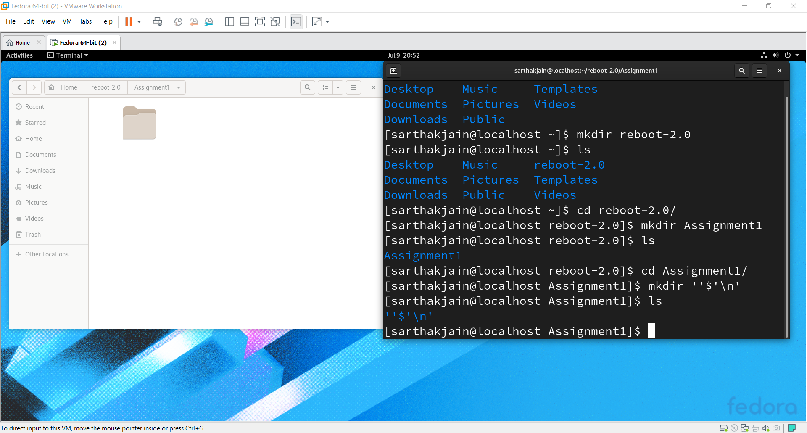
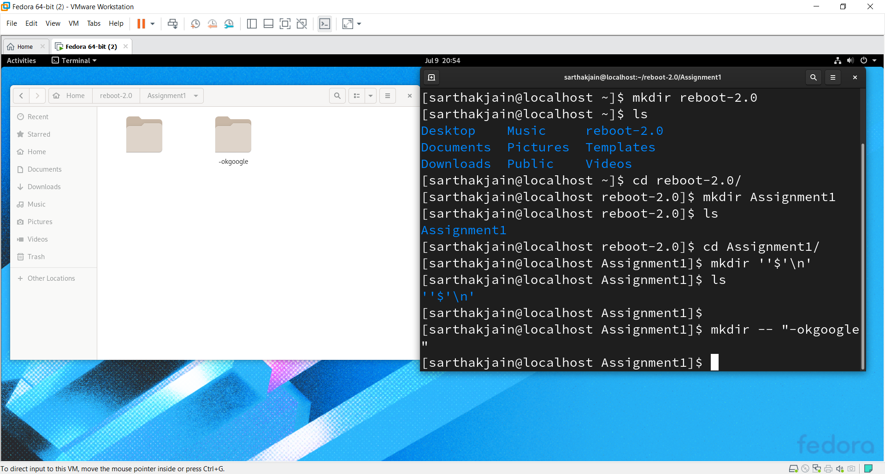
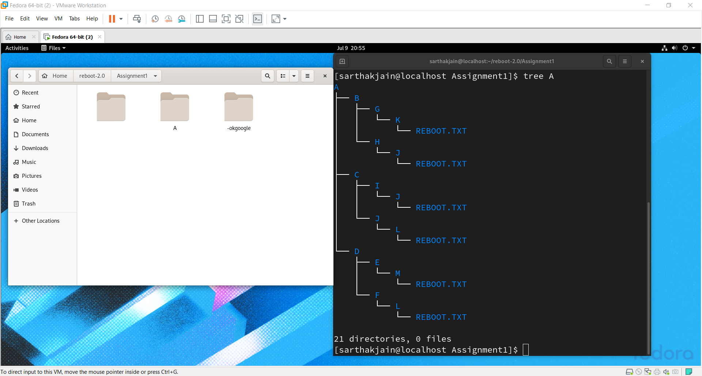
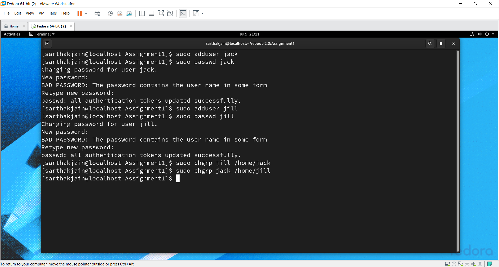
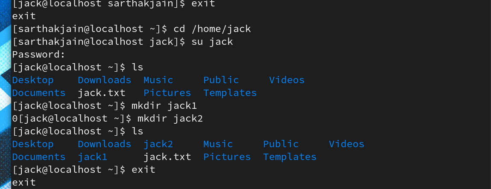
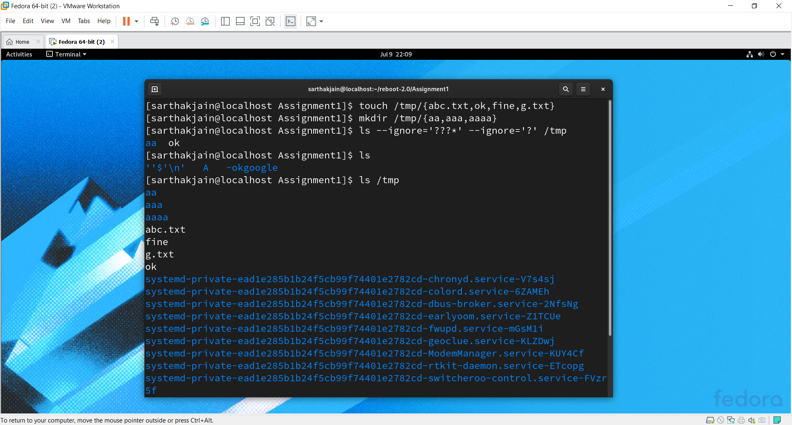
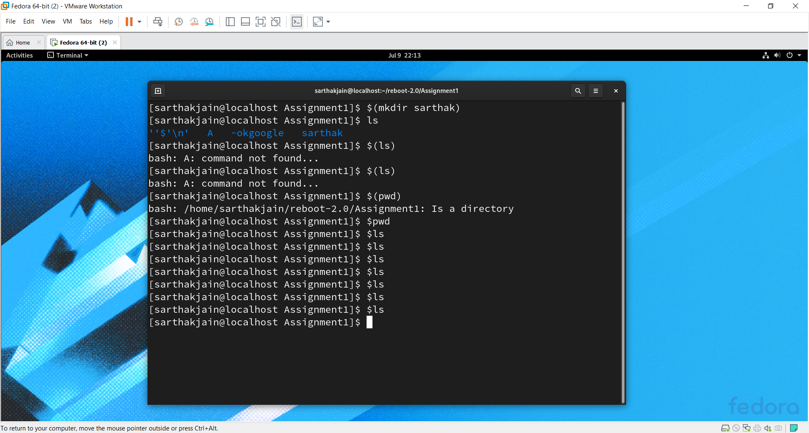

# Reboot-2.O

## Assignments

### 1. Block System call : block system call for date command and firefox that is both commands are installed but kernel rejects to run them


For this task we will be removing the execution permission from the commands so that they do not get executed when used, not even for root user. For this we will need the root user access.

1. We will edit the .bashrc file and set the alias for the commands.
```
alias date=": date"
alias firefox=":firefox" 
```
2. When we run the commands from the user no output will be shown and even the commands will not be uninstalled.

### 2. play with directory : (a) create a directory without name from command line  , (b) create a directory with name "-okgoogle"




(A) ```mkdir ''$'\n'``` ~> this will create a directory with ```enter sign``` as name and won't be visible in folder GUI view

(B) ```mkdir -- "-okgoolge"```


### 3. create a directory structure 



```
mkdir -p A/{B/{G/K/N/Reboot.txt,H/J/N/Reboot.txt},C/{I/J/N/Reboot.txt,J/L/N/Reboot.txt},D/{F/L/N/Reboot.txt,E/M/N/Reboot.txt}}
```

### 4 share and files and folder 




1. First we need to create the users jack and jill. Now we need to set the password for the users.
```
sudo adduser jack
sudo adduser jill

sudo passwd jack
sudo passwd jill
```
2. We need to add the home directories of the users to each other's group.
```
sudo chgrp jill /home/jack
sudo chgrp jack /home/jill
```
3. Switch to jack and create the files and folders. We can use ls to view the content.
```
su - jack -> Enter password for jack
vim jack.txt
mkdir jack1
mkdir jack2
ls
logout
```
4. Switch to jill and create the files and folders. We can use ls to view the content.
```
su - jill -> Enter password for jill
vim jill.txt
mkdir jill1
mkdir jill2
ls
logout
Now we can access each other user's file from the other user.
su - jack
mv jack1 /home/jill
mv jack2 /home/jill
mv jack.txt /home/jill
cd /home/jill
mv jill.txt $HOME
mv jill1 $HOME
mv jill2 $HOME
ls
cd
ls
logout
```

### 5. play with files and directories 



1. create  4 files named   abc.txt  ok  fine  g.txt  /tmp directory 
```sh
touch /tmp/{abc.txt,ok,fine,g.txt}
```
2. create  3  directories   aa aaa aaaa  under  /tmp directory 
```sh
mkdir /tmp/{aa,aaa,aaaa}
```
3. give ls command to  list the content of  /tmp directory , Condition:only list the content (file|directory)  having 2 char in their name.
```sh
ls --ignore='???*'
```

### 6. run command without any output : open terminal and type any command ~> once you press enter your output of given command must not  print ~> you are not allowed to redirect output anywhere 



We will use : before the command, for not printing it's output
```
: $(COMMAND)
```

### 7.  create a shell script
<ul>
  <li>create a shell script named /root/delvex.sh</li>
  <li>make sure it will run /bin/sh shell </li>
  <li>a user will be running this script my using a command name opensource</li>
  <li>when a user  run like  "opensource  time" it must give current time only</li>
  <li>when it runs like "opensource user"  it will give list of interactive shell users only</li>
 <li>when run like "opensource 100"  it must print "Hello Delvex" 100 times in interval of 1 sec</li>
  <li>if runs like  "opensource windows"  then it must shutdown </li>
  <li>if run opensource command without any parameter  then it must show out --</li>
  <ul>
    <li>name of kernel</li>
    <li>version of kernel</li>
    <li>current date in the format of  /DD/MM/YY</li>
    <li>name of OS</li>
    <li>last reboot time</li>
  </ul>
  </ul>
    
```
#!/bin/sh

# We will read single argument
if [ "$#" == 0 ]
then
	echo "Kernel Name: `uname`"
	echo "Kernel Version: `uname -r`"
	echo "Date: `date +%d`/`date +%m`/`date +%y`"
	echo "OS `cat /etc/os-release | head -1`"
	echo "last reboot info: "
	last reboot | head -2 | awk '{print "   " $5" "$6" "$7" "$8" "$9" "$10}'
elif [ "$1" == "time" ]
then
	date +%T
elif [ "$1" == "user" ]
then
 	users
elif [[ "$1" =~ ^[0-9]+$ ]]
then
	count=$1
	while [ $count != 0 ]
	do
		echo "Hello Delvex"
		sleep 1
		((count--))
	done
elif [[ "$1" == "windows" ]]
then
	shutdown now
fi
```

### 8. create a user will default settings
<ul>
  <li>create a user name  delvex  and password of this user will be fedora</li>
  <li>when user got created below listed things will come by default</li>
  <li>history size will be 5000</li>
  <li>history file will be  /home/delvex/myhist.txt</li>
  <li>default shell will be  /bin/sh </li>
</ul>


* For customization required as in question, we will create an shell script to be executed for our user

```
su root # switch to root user
cat <<M /etc/profile.d/delvex.sh
if [ $USER == "delvex" ]
then
	HISTSIZE=5000
	HISTFILE=/home/delevx/myhist.txt
	SHELL=/bin/sh
	export HISTSIZE HISTFILE SHELL
fi
M
adduser delvex
passwd delvex # set it as fedora
```
